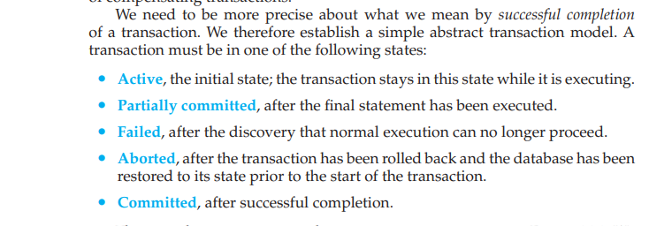
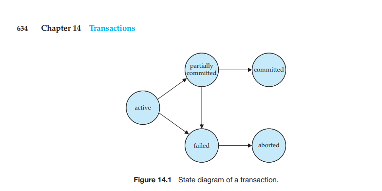

## Transaction States




👉 A transaction undergoes various states during its lifecycle. These states capture the different phases of a transaction's execution and help ensure data consistency and integrity.

1. **Active:**
   - In the Active state, a transaction is actively executing its operations.
   - It involves reading data, modifying data, or both, depending on the nature of the transaction.

2. **Partially Committed:**
   - The Partially Committed state signifies that the transaction has completed its execution successfully.
   - It is ready to be committed, but the changes have not been finalized and made permanent in the system.

3. **Failed:**
   - If an error occurs during the execution of a transaction, it enters the Failed state.
   - In this state, the transaction is considered unsuccessful, and a rollback may be performed to undo any changes made so far.

4. **Aborted:**
   - The Aborted state is the final state after a failed transaction.
   - The system has been rolled back to the state it was in before the transaction started, ensuring data consistency.

5. **Committed:**
   - In the Committed state, the transaction has been successfully completed.
   - All changes made by the transaction are permanently saved to the system, ensuring durability.

6. **Terminated:**
   - The Terminated state represents the end of a transaction's lifecycle.
   - It implies that the transaction has reached its final state, whether it be Committed, Aborted, or another conclusive state.

## Transaction State Diagram:

```
   +---------+         +---------+          +---------+
   |         |         |         |          |         |
   | Initial | ------> | Active  | -------->| Partial |
   | State   |         |         |          | Commit  |
   |         |         |         |          |         |
   +---------+         +---------+          +----+----+
             |              |               |    |
             |              |               |    |
             |              |               |    |
             +---------v    v    v----------+    v
   +---------+         +----------+         +-----------+
   |         |         |          |         |           |
   | Aborted | <-------|  Failed  |         | Committed |
   |         |         |          |         |           |
   +---------+         +----------+         +-----------+
       |                                         |
       |                                         |
       |                                         |
       | +---------------------------------------+
       | |   +------------+
       +---->| Terminated |
             +------------+
```
In this diagram:

- Arrows indicate transitions between different *states*.
- The *Initial state* transitions to the *Active state* as the transaction starts.
- From the *Active state*, the transaction can either transition to the *Partial Commit state* (if successful) or the *Aborted state* (if an error occurs).
- The *Aborted state* represents the end *state* for a transaction that encounters errors.
- The *Partial Commit state* can lead to either the *Committed state* (if the transaction proceeds successfully) or the *Aborted state* (if an error occurs).
- The *Committed state* is the final *state*, indicating a successful and permanent transaction.
- The *Aborted state* transitions directly to the *Failed state* to roll back the transaction.
