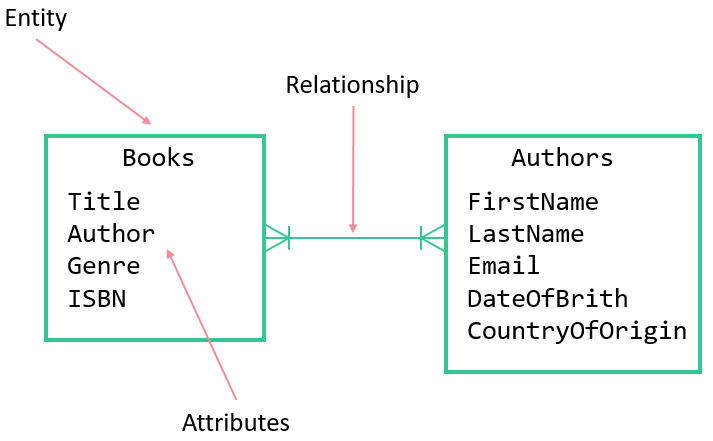
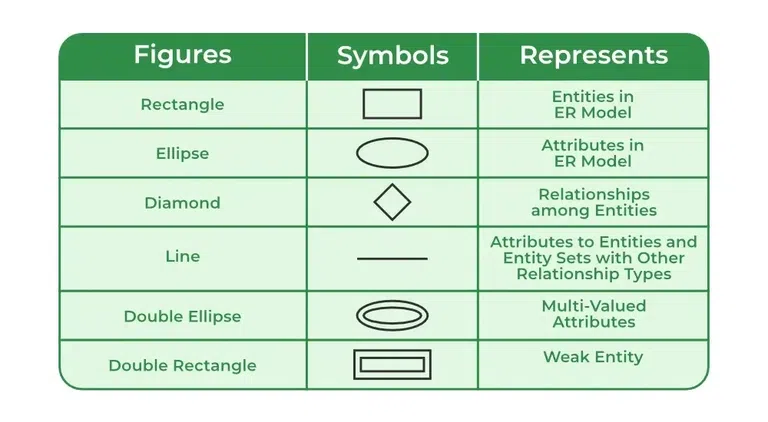
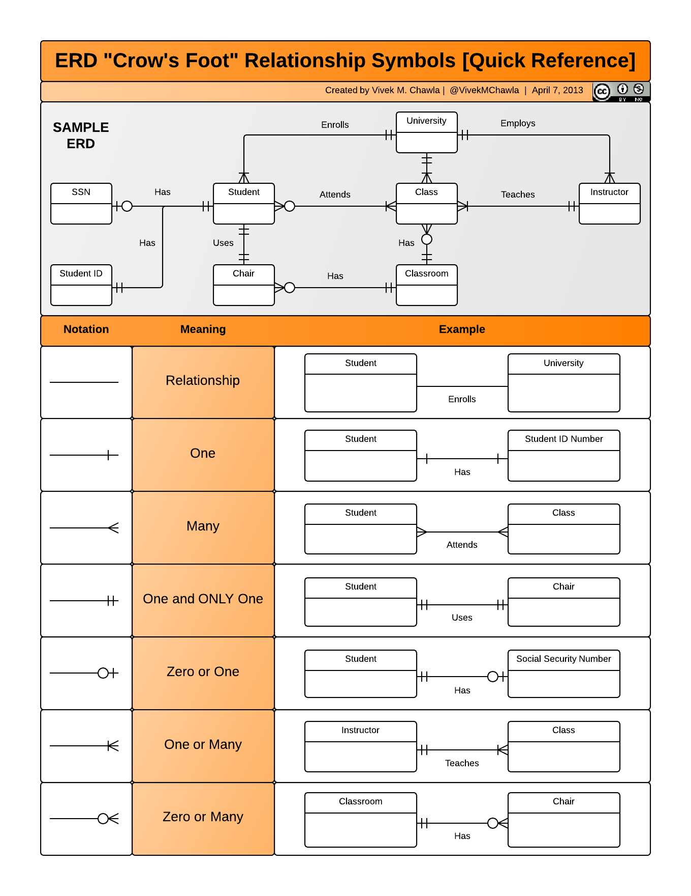

## **ER Diagram Components **

1. **Rectangle (Entity)**
   - Represents an entity, such as a table in a database.
   - Example: Entity "Customer" represented as a rectangle.

2. **Ellipse (Attribute)**
   - Represents attributes or properties of an entity.
   - Connected to the entity rectangle by a line.
   - Example: Attribute "Name" connected to the "Customer" entity.

3. **Diamond (Relationship)**
   - Signifies relationships between entities.
   - Contains the relationship name.
   - Connects entities to show associations.
   - Example: Relationship "Purchases" connecting "Customer" and "Product" entities.

4. **Double Ellipse (Multi-Valued Attribute)**
   - Indicates multi-valued attributes, which can have multiple values for a single entity.
   - Example: Multi-valued attribute "Phone Numbers" connected to the "Customer" entity.

5. **Double Rectangle (Weak Entity)**
   - Represents a weak entity, one that depends on another entity for identification.
   - Connected to the strong entity by a double diamond.
   - Example: Weak entity "Order" connected to the strong entity "Customer" by a double diamond.

6. **Oval (Derived Attribute)**
   - Represents derived attributes, whose values are calculated from other attributes.
   - Example: Derived attribute "Age" connected to the "Employee" entity.

7. **Dashed Oval (Key Attribute)**
   - Signifies key attributes within an entity, which uniquely identify records.
   - Example: Dashed oval around the key attribute "CustomerID" in the "Customer" entity.

8. **Double Rectangle (Weak Entity)**
   - Represents a weak entity, which doesn't have a primary key on its own and relies on another entity.
   - Example: Weak entity "Order" connected to the strong entity "Customer."

9. **Double Diamond (Aggregation)**
   - Represents aggregation, where a higher-level entity is composed of related entities.
   - Example: Aggregation "Department" composed of "Employee" entities.

10. **Dashed Line (Partial Participation)**
    - Indicates partial participation in a relationship, where an entity's participation is optional.
    - Example: Dashed line indicating partial participation of "Product" in the "Manufactures" relationship.

11. **Double Dashed Line (Total Participation)**
    - Represents total participation in a relationship, meaning an entity's participation is mandatory.
    - Example: Double dashed line indicating total participation of "Department" in the "Manages" relationship.

12. **Arrow (Cardinality)**
    - Shows the cardinality of a relationship, indicating how many entities are involved.
    - Examples: "1" (One), "M" (Many), "0" (Zero).
    - Example: Arrow connecting "1" on one end and "M" on the other end indicating a "One-to-Many" relationship.

13. **Generalization/Specialization (Triangle)**
    - Represents a generalization/specialization hierarchy, where a generalized entity branches into specialized entities.
    - Example: Generalization "Animal" branching into "Mammal" and "Bird" specialized entities.

14. **Dashed Line with Arrow (Inheritance)**
    - Used to show inheritance relationships in generalization/specialization hierarchies.
    - Example: Dashed line with arrow connecting "Employee" and "Manager" entities in an inheritance relationship.
