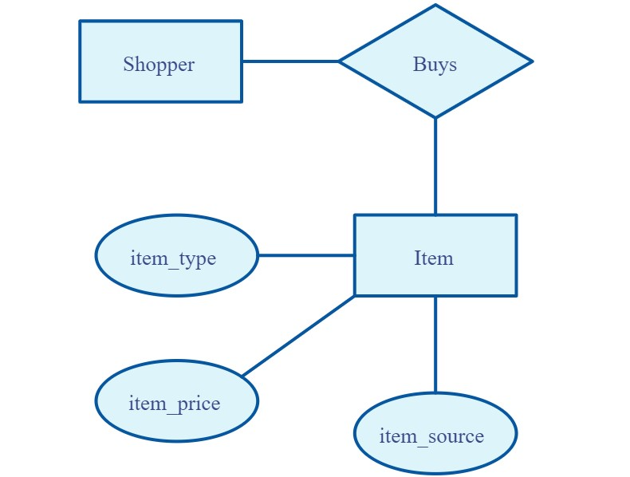

## The Entity-Relationship Model

- **Definition**: The Entity-Relationship Model (ER Model) is a visual representation used in database design to describe the structure of a database system.
- Understanding the Entity-Relationship Model is essential for designing well-structured databases, ensuring efficient data management and retrieval.
- It provides a clear blueprint for how data entities are related in a database system.

- **Key Concepts**:
  1. **Entities**: Represent real-world objects or concepts, such as "Customer," "Product," or "Employee."
  2. **Attributes**: Characteristics or properties of entities, like "Name," "ID," or "Date of Birth."
  3. **Relationships**: Associations between entities, indicating how they are related. Examples include "Works for," "Purchases," or "Manages."
  4. **Cardinality**: Describes the number of occurrences in a relationship. Common cardinalities are "One-to-One," "One-to-Many," and "Many-to-Many."
  5. **Primary Keys**: Primary keys uniquely identify each entity within a table. They are crucial for data integrity and record retrieval.
  6. **Foreign Keys**: Foreign keys link entities in different tables, establishing relationships between them.

- **ER Diagram**:
  - **Components**: An ER diagram consists of entities represented as rectangles, attributes within ellipses, and relationships as diamond shapes.
  - **Connectivity**: Lines connect entities and show the relationship between them. Cardinality and participation constraints can be indicated using notations like "1" or "M" (many).

- **Purpose**: The ER Model helps:
  - Visualize and design the structure of a database.
  - Define how data is organized and related.
  - Create a blueprint for database implementation.

- **Example**:
  - Consider an ER diagram for a library database:
  
    - **Entities**: "Book," "Author," "Borrower."
    - **Attributes**: "Book Title," "Author Name," "Borrower Name."
    - **Relationships**: "Written by" (between "Book" and "Author"), "Borrowed by" (between "Book" and "Borrower").
    - **Cardinality**: "One-to-Many" (a book can be written by one or more authors).
    - **Keys**: "Book ISBN" as the unique identifier for books.

